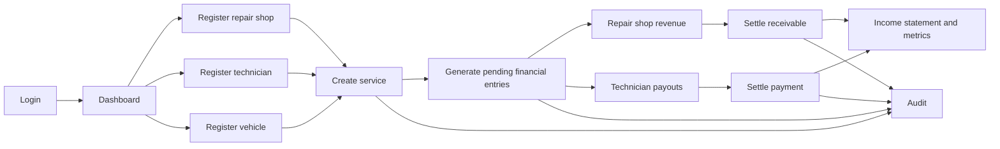
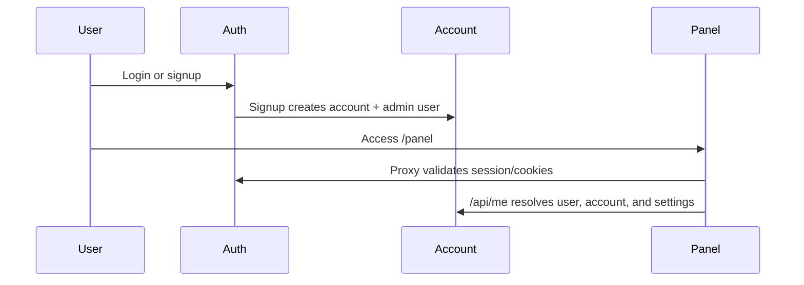

<p align="center">
  
</p>

# PDR Hub

Internal platform for managing automotive services, repair shops, technicians, vehicles, and finances, focused on simple operations for paintless dent repair (PDR).

The system was designed for internal use: login protected by Supabase Auth, data isolated by account, straightforward pages in `page.jsx`, simple tables, and fast operation without a complex backend.

## Operational Flow



## Modules

| Module | Route | Purpose |
| --- | --- | --- |
| Dashboard | `/panel` | Overview, filters, revenue, receivables, and metrics. |
| Services | `/panel/servicos` | Service registration, vehicle, repair shop, technicians, status, and automatic financial entries. |
| Repair Shops | `/panel/oficinas` | Registration of partner repair shops and technician assignments. |
| Technicians | `/panel/tecnicos` | Technician registration, personal information, payment details, and photo. |
| Vehicles | `/panel/veiculos` | Registration and lookup of license plates, make, model, and vehicle data. |
| Finance | `/panel/financeiro` | Revenue, expenses, payouts, settlement, and reopening. |
| Income Statement | `/panel/dre` | Financial performance grouped by period/categories. |
| Audit | `/panel/auditoria` | Action history by user, date, time, and module. |
| Users | `/panel/usuarios` | Creation and management of account users. |
| Settings | `/panel/configuracoes` | Account information and operational preferences. |
| My Profile | `/panel/perfil` | Name, email, and profile photo of the logged-in user. |
| Search | `/panel/busca?q=termo` | Global search by license plate, repair shop, technician, service, finance, and audit records. |
| Roberto | Available across `/panel` | AI assistant for operational questions, record lookup, guided creation, and confirmed actions. |

## Global Search

The header search redirects to `/panel/busca` and queries the main records associated with the logged-in account:

- Services
- Repair shops
- Technicians
- Vehicles
- Financial transactions
- Audit logs

Results are grouped by module, with quick links to open the corresponding area.

## Roberto AI Assistant

Roberto is the AI chat assistant available throughout the internal panel through `src/components/roberto/roberto-widget.jsx`.

The widget opens as a floating chat, keeps the current conversation in `sessionStorage`, shows quick-start suggestions, and sends authenticated requests to `/api/roberto`. The server-side route calls OpenRouter using `OPENROUTER_API_KEY` and `OPENROUTER_MODEL`, builds the account context from the logged-in user, and restricts data access to the current `conta_id`.

Roberto can help with:

- Searching services, repair shops, technicians, vehicles, financial entries, DRE, audit logs, users, and settings.
- Answering how-to questions about real PDR Hub screens and flows.
- Preparing creation or update operations for repair shops, technicians, vehicles, services, and financial settlements.
- Showing a confirmation card before any write operation is committed.

Write operations follow a two-step flow:

1. The assistant gathers and validates the required data.
2. The user confirms the generated preview in the chat UI.
3. The server executes the confirmed action, records audit information when applicable, and the widget emits `roberto:data-changed` so panel screens can refresh their data.

The chat intentionally treats stored records and compact session state as untrusted data. Roberto must use the exposed tools for real platform data, cannot choose ambiguous records silently, and cannot complete a write from a plain text confirmation message.

## Authentication and Account



Main rules:

- `src/proxy.js` protects `/panel`.
- Users without an active session are redirected to `/login`.
- Authenticated users trying to access login/signup are redirected back to `/panel`.
- The first signup creates the account and the administrator user.
- New users are created in `/panel/usuarios` and linked to the same `conta_id`.

## Data Model


## Automatic Financial Entries

When creating or editing an operational service, the platform synchronizes the financial records:

- Repair shop revenue with origin `servico`.
- Payout expenses for each technician with origin `repasse_tecnico`.
- Initial financial status set to `pendente`.
- Accrual date equal to `data_servico`.
- Due date calculated using `dias_vencimento_servico`.

Services with status `cancelado` do not generate automatic financial entries, preventing incorrect charges or payouts.

## Date Policy

The operation is designed for Italy. Therefore:

- The default timezone is `Europe/Rome`.
- Civil date fields use `YYYY-MM-DD`.
- Service, accrual, and settlement dates do not depend on the browser timezone.
- The central helper is located at `src/lib/dates.js`.
- Display formatting uses the account locale/settings when available.

This prevents inconsistencies such as creating a record in Brazil and having the financial entry appear on the previous day.

## Stack

- Next.js 16 App Router
- React 19
- Tailwind CSS 4
- Supabase Auth
- Supabase Database
- Supabase Storage
- Lucide React
- Sonner
- pnpm

## Main Structure

```text
src/
  app/
    (auth)/             Login, signup, and password recovery
    (panel)/panel/      Internal platform modules
    api/                Auth, current user, user routes, and Roberto
    layout.js           Metadata, providers, and icons
  components/
    layout/             Header, sidebar, shell, and auth screens
    roberto/            Floating AI assistant chat widget
    shared/             Button, Modal, Drawer, Form, Table
    providers/          Theme and toast
  lib/
    roberto/            Roberto context, tools, confirmations, and audit helpers
    supabase/           Browser, server, and admin clients
    dates.js            Civil dates and timezone
    formatters.js       BR/IT formatters
    inputMasks.js       Input masks
public/
  Logo_Completa.png
  Logo_Curta.png
```

## Environment Variables

Create a `.env` file with:

```env
NEXT_PUBLIC_SUPABASE_URL=
NEXT_PUBLIC_SUPABASE_ANON_KEY=
SUPABASE_SERVICE_ROLE_KEY=
OPENROUTER_API_KEY=
OPENROUTER_MODEL=
```

`SUPABASE_SERVICE_ROLE_KEY` is used only on the server for administrative operations, such as creating users in Supabase Auth.

`OPENROUTER_API_KEY` and `OPENROUTER_MODEL` enable Roberto, the operational assistant available throughout `/panel`. Both variables are read only by the server-side Route Handler. Use an OpenRouter model with reliable tool/function calling support; changing the model requires only updating `OPENROUTER_MODEL` and restarting the application.

## Commands

```bash
pnpm install
pnpm dev
pnpm build
pnpm start
pnpm lint
```

To validate the build without using the pnpm script:

```bash
node_modules/.bin/next build
```

## Operational Checklist

1. Create an account through signup.
2. Update account information in Settings.
3. Register repair shops.
4. Register technicians and upload photos.
5. Register vehicles.
6. Create services.
7. Review the automatically generated financial entries.
8. Settle receivables and technician payouts.
9. Monitor the Dashboard and Income Statement.
10. Check the Audit module whenever you need to track changes.

## Product Images

Full logo:


Short icon used as favicon/apple icon:


## Implementation Notes

- The platform uses client-side pages with Supabase accessed directly from the frontend, following the project's internal pattern.
- Core security relies on the authenticated session, data isolation through `conta_id`, and Supabase policies/configuration.
- The audit module records the main operational and administrative changes.
- The header includes global search and a profile menu.
- The authentication layout is fixed to the light theme.
