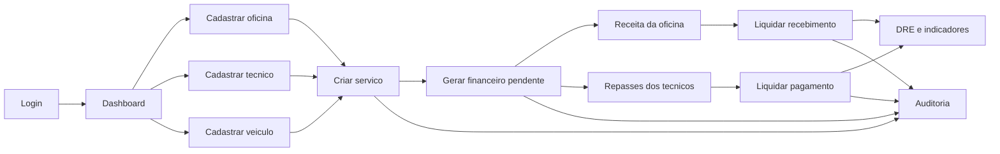
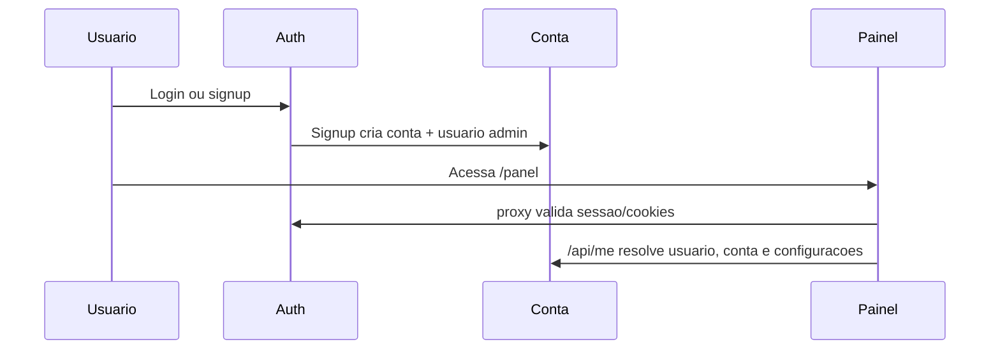
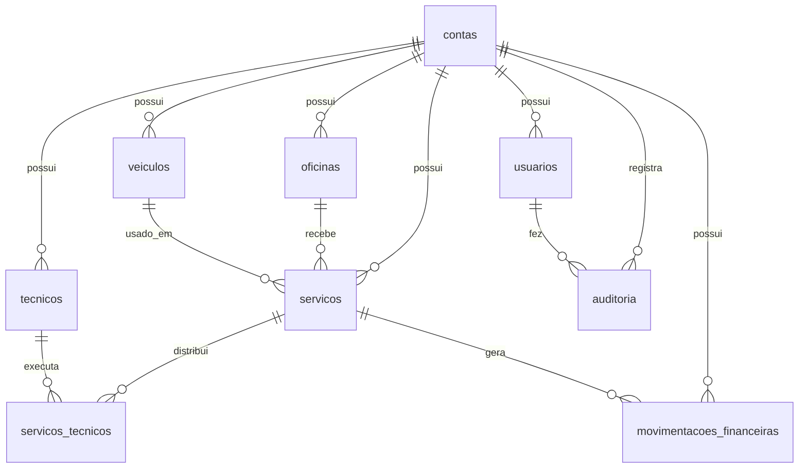
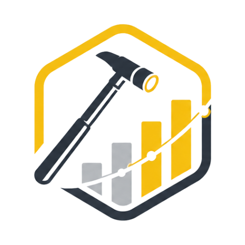

<p align="center">
  
</p>

# PDR Hub

Plataforma interna para gestao de servicos automotivos, oficinas, tecnicos, veiculos e financeiro, com foco em operacao simples para martelinho/PDR.

O sistema foi desenhado para uso interno: login protegido por Supabase Auth, dados isolados por conta, paginas diretas em `page.jsx`, tabelas simples e operacao rapida sem backend complexo.

## Fluxo Da Operacao



## Modulos

| Modulo | Rota | Funcao |
| --- | --- | --- |
| Dashboard | `/panel` | Visao geral, filtros, faturamento, recebimentos e indicadores. |
| Servicos | `/panel/servicos` | Cadastro de servicos, veiculo, oficina, tecnicos, status e financeiro automatico. |
| Oficinas | `/panel/oficinas` | Cadastro das oficinas parceiras e vinculo com tecnicos. |
| Tecnicos | `/panel/tecnicos` | Cadastro dos tecnicos, dados pessoais, dados de pagamento e foto. |
| Veiculos | `/panel/veiculos` | Cadastro e consulta de placas, marca, modelo e dados do veiculo. |
| Financeiro | `/panel/financeiro` | Receitas, despesas, repasses, liquidacao e reabertura. |
| DRE | `/panel/dre` | Resultado economico agrupado por periodo/categorias. |
| Auditoria | `/panel/auditoria` | Historico de acoes por usuario, data, hora e modulo. |
| Usuarios | `/panel/usuarios` | Criacao e gestao dos usuarios da conta. |
| Configuracoes | `/panel/configuracoes` | Dados da conta e preferencias operacionais. |
| Meu Perfil | `/panel/perfil` | Nome, email e foto de perfil do usuario logado. |
| Busca | `/panel/busca?q=termo` | Busca global por placa, oficina, tecnico, servico, financeiro e auditoria. |

## Busca Global

A busca do header direciona para `/panel/busca` e consulta os principais cadastros da conta logada:

- Servicos
- Oficinas
- Tecnicos
- Veiculos
- Movimentacoes financeiras
- Auditoria

O resultado e agrupado por modulo, com link rapido para abrir a area correspondente.

## Autenticacao E Conta



Regras principais:

- `src/proxy.js` protege `/panel`.
- Usuario sem sessao vai para `/login`.
- Usuario autenticado tentando abrir login/signup volta para `/panel`.
- O primeiro signup cria a conta e o usuario administrador.
- Novos usuarios sao criados em `/panel/usuarios` e vinculados a mesma `conta_id`.

## Modelo De Dados



## Financeiro Automatico

Ao criar ou editar um servico operacional, a plataforma sincroniza o financeiro:

- Receita da oficina com origem `servico`.
- Despesas de repasse para cada tecnico com origem `repasse_tecnico`.
- Status financeiro inicial como `pendente`.
- Data de competencia igual a `data_servico`.
- Vencimento calculado por `dias_vencimento_servico`.

Servicos `cancelado` nao geram financeiro automatico para evitar cobranca ou repasse falso.

## Politica De Datas

A operacao e pensada para Italia. Por isso:

- O timezone padrao e `Europe/Rome`.
- Campos de data civil usam `YYYY-MM-DD`.
- Datas de servico, competencia e liquidacao nao dependem do fuso do navegador.
- O helper central fica em `src/lib/dates.js`.
- Formatacao de exibicao usa locale/configuracao da conta quando disponivel.

Essa regra evita divergencias como criar no Brasil e o financeiro aparecer com o dia anterior.

## Stack

- Next.js 16 App Router
- React 19
- Tailwind CSS 4
- Supabase Auth
- Supabase Database
- Supabase Storage
- Lucide React
- Sonner
- pnpm

## Estrutura Principal

```text
src/
  app/
    (auth)/             Login, signup e recuperacao de senha
    (panel)/panel/      Modulos internos da plataforma
    api/                Rotas de auth, usuario atual e usuarios
    layout.js           Metadata, providers e icones
  components/
    layout/             Header, sidebar, shell e telas auth
    shared/             Button, Modal, Drawer, Form, Table
    providers/          Theme e toast
  lib/
    supabase/           Clients browser, server e admin
    dates.js            Datas civis e timezone
    formatters.js       Formatadores BR/IT
    inputMasks.js       Mascaras de input
public/
  Logo_Completa.png
  Logo_Curta.png
```

## Variaveis De Ambiente

Crie `.env` com:

```env
NEXT_PUBLIC_SUPABASE_URL=
NEXT_PUBLIC_SUPABASE_ANON_KEY=
SUPABASE_SERVICE_ROLE_KEY=
```

`SUPABASE_SERVICE_ROLE_KEY` e usada apenas no servidor para operacoes administrativas, como criar usuarios no Supabase Auth.

## Comandos

```bash
pnpm install
pnpm dev
pnpm build
pnpm start
pnpm lint
```

Para validar build sem passar pelo script do pnpm:

```bash
node_modules/.bin/next build
```

## Checklist Operacional

1. Criar conta pelo signup.
2. Ajustar dados da conta em Configuracoes.
3. Cadastrar oficinas.
4. Cadastrar tecnicos e fotos.
5. Cadastrar veiculos.
6. Criar servicos.
7. Conferir financeiro automatico.
8. Liquidar recebimentos e repasses.
9. Acompanhar Dashboard e DRE.
10. Consultar Auditoria quando precisar rastrear alteracoes.

## Imagens Do Produto

Logo completa:


Icone curto usado como favicon/apple icon:



## Observacoes De Implementacao

- A plataforma usa paginas client-side com Supabase direto no front, seguindo o padrao interno do projeto.
- A seguranca principal vem da sessao autenticada, do isolamento por `conta_id` e das politicas/configuracoes do Supabase.
- A auditoria registra as principais alteracoes operacionais e administrativas.
- O header possui busca global e menu de perfil.
- O layout auth e fixo em tema claro.
